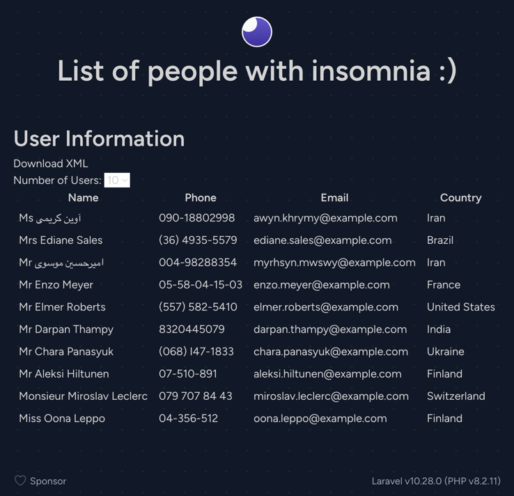

## Insomnia

---

---

Simple Laravel-based app to utilize free API for testing purposes.

You can navigate to the application directory and start Laravel Sail. 

Laravel Sail provides a simple command-line interface for interacting with Laravel's default Docker configuration:

`./vendor/bin/sail up`

Once the application's Docker containers have been started, you can access the application in your web browser at: http://localhost.
